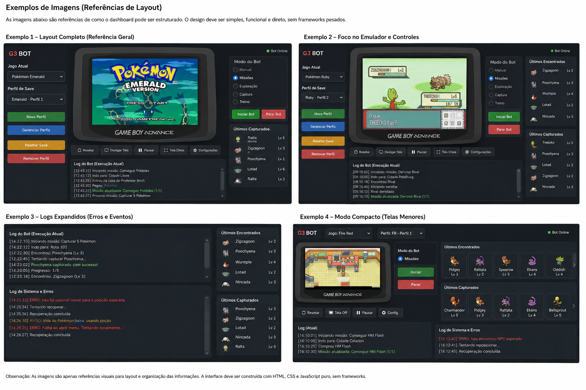

# AGENT.md — Pokémon Gen 3 Auto Mission Bot

## 1. Objetivo deste documento

Este arquivo define as regras obrigatórias para qualquer agente de IA que trabalhe neste repositório.

O projeto é um **fork de uma aplicação existente**, escrita em **Python**, cujo objetivo principal é automatizar jogos Pokémon da terceira geração.

Jogos suportados:

- Pokémon Ruby
- Pokémon Sapphire
- Pokémon Emerald
- Pokémon FireRed
- Pokémon LeafGreen

O foco principal do projeto é:

1. executar automaticamente as missões do jogo;
2. validar e cumprir pré-requisitos necessários para cada missão;
3. permitir acompanhamento e controle manual do emulador;
4. disponibilizar uma interface web interna simples para operação do bot.

O agente deve trabalhar **sobre a arquitetura e os recursos já existentes no fork**.

Não substituir, reescrever ou modernizar componentes sem necessidade concreta.

---

# 2. Regra principal de comportamento do agente

## O agente deve obedecer estritamente ao escopo solicitado.

É proibido:

- inventar funcionalidades;
- ampliar o escopo por iniciativa própria;
- criar abstrações sem necessidade;
- trocar tecnologias sem solicitação;
- refatorar partes não relacionadas à tarefa;
- criar "melhorias futuras" no código durante uma tarefa;
- adicionar dependências apenas por preferência técnica;
- reinterpretar uma solicitação clara;
- criar sistemas paralelos quando já existe uma implementação reutilizável;
- modificar comportamento existente que não tenha relação direta com a solicitação.

Quando houver mais de uma solução tecnicamente válida, escolher:

> **a solução mais simples, direta e compatível com o código existente.**

Não transformar uma tarefa pequena em uma mudança arquitetural.

## 2.1. Diretrizes operacionais reforçadas

Estas diretrizes são obrigatórias em toda tarefa:

1. Ler este `AGENTS.md` antes de alterar o projeto.
2. Procurar a implementação existente relacionada à solicitação.
3. Reutilizar a arquitetura e os recursos atuais.
4. Se a solicitação permitir uma interpretação relevante que possa mudar a solução, perguntar antes de alterar.
5. Fazer a menor mudança possível para cumprir exatamente a solicitação.
6. Nunca colocar configuração de infraestrutura dentro do código da aplicação.
7. Não executar Docker, aplicação, testes ou validações sem autorização expressa do usuário.
8. Parar assim que a solicitação estiver concluída, sem melhorias ou alterações adicionais.

---

# 3. Regra de preservação do fork

Este projeto foi criado a partir de outro projeto.

Portanto, antes de implementar qualquer alteração, o agente deve identificar:

- como o projeto atual inicializa o emulador;
- como os jogos são carregados;
- como os saves/profiles são tratados;
- como o bot seleciona seus modos;
- como os encontros Pokémon são detectados;
- como as capturas são detectadas;
- como os logs existentes são gerados;
- quais APIs internas já estão disponíveis;
- quais objetos representam o estado atual do jogo;
- como o loop principal do bot funciona.

## Reutilização obrigatória

Se o projeto original já possui uma função, serviço, classe, callback, evento ou API para realizar determinada operação, o agente deve reutilizá-la.

Não criar uma segunda implementação para:

- reset do emulador;
- carregamento de ROM;
- controle do jogador;
- leitura de save;
- troca de profile;
- seleção de modo do bot;
- captura de frame;
- leitura do estado do jogo;
- registro de encontros;
- registro de capturas.

---

# 4. Tecnologias do dashboard

O dashboard deve ser propositalmente simples.

## Frontend

Usar somente:

- HTML;
- CSS;
- JavaScript puro.

Não usar:

- React;
- Vue;
- Angular;
- Svelte;
- Next.js;
- Nuxt;
- jQuery;
- Bootstrap;
- Tailwind;
- Material UI;
- qualquer framework SPA;
- qualquer biblioteca de componentes sem necessidade expressamente solicitada.

## Backend web

O dashboard deve aproveitar Python e a aplicação existente.

Evitar frameworks web.

Priorizar recursos da biblioteca padrão do Python ou a infraestrutura mínima já existente no projeto.

Não adicionar Flask, Django, FastAPI ou equivalente apenas para montar o dashboard, salvo ordem explícita do usuário.

## Comunicação

A comunicação entre dashboard e backend deve ser simples.

Pode utilizar, conforme a necessidade concreta do código existente:

- HTTP;
- endpoints JSON simples;
- Server-Sent Events;
- WebSocket somente se já existir ou se for realmente necessário para a transmissão contínua do emulador.

Não criar uma camada de API complexa.

---

# 5. Página inicial do dashboard

Como se trata inicialmente de uma ferramenta interna:

## NÃO EXISTE LOGIN.

Não implementar:

- autenticação;
- cadastro;
- recuperação de senha;
- OAuth;
- JWT;
- RBAC;
- tela de usuários;
- permissões;
- ACL.

Só implementar autenticação futuramente mediante solicitação explícita.

A tela inicial deve permitir selecionar ou acessar uma instância de qualquer jogo suportado:

- Ruby;
- Sapphire;
- Emerald;
- FireRed;
- LeafGreen.

A interface deve ser funcional e compacta.

Não criar landing page promocional.

---

# 6. Tela do jogo

Ao acessar um jogo, a principal área da página deve exibir o jogo rodando no emulador.

O usuário deve conseguir acompanhar visualmente a execução em tempo real ou na melhor taxa de atualização suportada pela arquitetura atual.

## Controles manuais

O dashboard deve permitir controlar o jogo manualmente.

O controle deve oferecer, no mínimo, os mesmos comandos relevantes que a UI atual do emulador disponibiliza ao projeto.

Exemplos típicos:

- ↑
- ↓
- ←
- →
- A
- B
- Start
- Select

Se o emulador atual possuir outros controles úteis, reutilizá-los.

Não inventar controles inexistentes.

---

# 7. Controle de modos do bot

Na mesma área operacional do emulador deve existir a seleção do modo de funcionamento do bot.

A interface web deve refletir os modos que **já existem no projeto**.

O agente não deve inventar novos modos.

Exemplos:

- modo manual;
- modo automático;
- modos específicos já oferecidos pelo fork;
- seleção de estratégia existente.

Se os nomes reais forem diferentes, usar os nomes reais do projeto.

A UI deve apenas controlar a implementação existente.

---

# 8. Painel de gestão do emulador

Logo abaixo da área principal do emulador deve existir uma seção de gerenciamento da instância atual.

Ela deve oferecer operações como:

- Resetar emulador;
- Desligar/ocultar a tela do emulador;
- Reativar a tela;
- Gerenciar profiles;
- Selecionar profile;
- Criar profile, caso esse recurso já exista;
- Remover profile;
- Resetar profile/save;
- Carregar save;
- operações equivalentes já existentes no projeto.

## Operações destrutivas

Operações destrutivas devem pedir confirmação visual simples no browser.

Exemplos:

- apagar profile;
- resetar save;
- sobrescrever save.

Não criar workflow complexo de confirmação.

---

# 9. Gestão de saves e profiles

A interface deve refletir o sistema real de profiles do projeto.

Cada profile deve exibir apenas informações realmente disponíveis.

Exemplos possíveis:

- nome;
- jogo;
- save atual;
- última utilização;
- status.

Não criar banco de dados novo se o projeto já possui armazenamento suficiente para isso.

Não migrar saves para outra estrutura sem necessidade explícita.

---

# 10. Janela de atividade do bot

Abaixo da gestão do emulador deve existir uma janela de acompanhamento da atividade atual.

Essa área deve mostrar informações operacionais de alto valor, como:

- missão atual;
- objetivo atual;
- pré-requisito em avaliação;
- ação que o bot está executando;
- mudança de mapa/local;
- interação importante;
- batalha iniciada;
- batalha encerrada;
- tentativa de captura;
- captura concluída;
- progresso relevante.

O conteúdo deve aproveitar os dados que o bot já conhece.

Não fabricar "estado de missão" baseado em inferência visual se já existir uma fonte determinística no projeto.

---

# 11. Últimos Pokémon encontrados e capturados

A interface deve possuir uma faixa pequena e horizontal, com rolagem, mostrando os Pokémon encontrados recentemente.

Pode ser implementada como um pequeno `horizontal scroll`.

Ordenação obrigatória:

> **mais recente primeiro.**

Cada item pode mostrar, conforme dados disponíveis:

- sprite;
- nome;
- nível;
- encontrado/capturado;
- horário;
- shiny, quando aplicável.

O mesmo componente deve deixar visualmente claro quando o Pokémon foi:

- somente encontrado;
- capturado.

Não transformar esse elemento em Pokédex.

Não criar página de coleção sem solicitação.

O objetivo é somente apresentar a atividade recente.

---

# 12. Console de logs

Mais abaixo na página deve existir uma área de logs detalhados.

Ela deve centralizar mais informações que o log simplificado de atividade.

Deve incluir:

- logs atuais do terminal;
- logs do bot;
- logs do emulador relevantes;
- warnings;
- erros;
- exceptions;
- stack traces quando disponíveis;
- eventos de encontro;
- eventos de captura;
- mudanças de modo;
- operações de profile/save;
- falhas de automação.

## Reutilização do logging

Não substituir o mecanismo atual de logging.

O dashboard deve consumir o logging existente sempre que possível.

Pode ser criado um handler adicional para enviar as mensagens ao dashboard, desde que isso não quebre os handlers atuais.

## Filtros simples

É permitido oferecer filtros simples como:

- Todos;
- Info;
- Warning;
- Error;
- Encontros;
- Capturas.

Não implementar observabilidade corporativa.

Não adicionar Elasticsearch, Logstash, Grafana, Loki, OpenTelemetry ou equivalentes.

---

# 13. Layout de referência

A referência visual oficial para o dashboard é a imagem abaixo.

Ela **substitui o wireframe textual anterior** e deve orientar a distribuição dos blocos, a densidade das informações, a hierarquia visual e a priorização operacional da interface.

Arquivo associado a este documento:

- `dashboard_layout_reference.png`



## Diretrizes obrigatórias derivadas da referência visual

A interface final não precisa ser uma cópia pixel-perfect da imagem, porém deve preservar a mesma lógica estrutural:

- o emulador é o elemento central e principal da tela;
- a seleção de jogo e profile deve ficar em posição de fácil acesso;
- o modo do bot deve ficar visível e fácil de alternar;
- os controles operacionais do emulador devem ficar próximos da tela do jogo;
- a gestão do emulador/save/profile deve ficar logo abaixo ou acoplada ao bloco principal;
- a atividade atual e o progresso da missão devem ficar claramente visíveis;
- os últimos Pokémon encontrados/capturados devem aparecer em área pequena, rápida e ordenada do mais recente para o mais antigo;
- o log principal deve ficar sempre visível;
- o log expandido de sistema/erros deve existir em uma área separada ou claramente distinguível;
- o dashboard deve continuar com aparência de ferramenta operacional interna, e não de produto SaaS.

Os quatro exemplos visuais da imagem servem como referência válida para:

- layout completo;
- foco no emulador e controles;
- logs expandidos;
- modo compacto.

Se houver dúvida de layout, esta imagem deve ser considerada a principal referência visual do projeto.

---

# 14. Responsividade

O dashboard será usado principalmente em desktop.

Priorizar desktop.

Deve continuar utilizável em resoluções menores, mas não gastar esforço criando uma experiência mobile sofisticada.

Não implementar design mobile-first complexo.

---

# 15. Missões e pré-requisitos

A automação das missões é o objetivo funcional principal do projeto.

Cada missão deve possuir condições verificáveis.

Exemplos:

- mapa/localização necessária;
- evento anterior concluído;
- item possuído;
- HM obtido;
- badge necessária;
- Pokémon específico;
- flag de memória/save;
- NPC já interagido;
- batalha já concluída;
- variável interna do jogo;
- estado de quest;
- outro pré-requisito determinístico.

Sempre priorizar dados extraídos do estado real do jogo/save sobre heurísticas visuais.

## 15.1. Base de dados de missões = fonte absoluta

A base de dados/catálogo de missões é a **fonte absoluta de verdade** para a automação.

Isso significa que:

- novas missões devem nascer a partir dessa base;
- os gatilhos das missões devem ser definidos nessa base;
- os pré-requisitos devem ser definidos nessa base;
- as condições de conclusão devem ser definidas nessa base;
- a seleção da próxima missão deve depender dessa base;
- o motor não deve espalhar regras hardcoded por vários arquivos quando essas regras pertencem ao catálogo.

O catálogo de missões deve ser o ponto central que dirige a automação.

## 15.2. Gatilhos e ações de novas missões

Toda nova missão deve ser registrada com metadados suficientes para execução automática, preferencialmente contendo algo conceitualmente equivalente a:

- identificador da missão;
- jogo(s) aplicáveis;
- pré-requisitos;
- gatilho/condição de ativação;
- ação principal ou sequência de ações;
- critério de conclusão;
- fallback/recuperação, quando aplicável.

O agente **não deve inventar funções novas** se o comportamento necessário já existir em outros modos, fluxos, utilitários ou rotinas do projeto.

Ao cadastrar novas missões, deve sempre tentar ligar a missão às funções existentes.

## 15.3. Reaproveitamento máximo de modos e funções existentes

É obrigatório reaproveitar ao máximo:

- modos já existentes;
- funções já existentes;
- rotinas de movimento;
- rotinas de navegação;
- rotinas de interação com NPC;
- rotinas de batalha;
- rotinas de captura;
- rotinas de leitura de estado;
- rotinas de verificação de flags;
- rotinas de save/profile;
- qualquer utilitário já implementado no fork.

Não duplicar lógica só porque a missão é nova.

A missão nova deve preferencialmente **orquestrar** capacidades já existentes em vez de recriar comportamento.

## 15.4. Execução dinâmica orientada por catálogo

O sistema deve ser o mais automático e dinâmico possível.

Se a arquitetura atual permitir, ou se isso for a solução mais simples e aderente ao projeto, a base de dados de missões pode apontar dinamicamente para funções já existentes do sistema.

Isso pode ser feito por mecanismos como:

- registro/dispatcher por nome de função;
- mapeamento de string para callable;
- resolução dinâmica de handlers;
- `eval`, quando isso for realmente o encaixe mais simples no projeto atual.

### Preferência do projeto

Se for possível usar `eval` ou mecanismo equivalente para executar funções **já existentes e conhecidas do projeto**, isso é aceitável e até desejável neste contexto, porque reduz acoplamento manual e facilita o cadastro dinâmico de missões.

### Restrições desse comportamento dinâmico

Mesmo com essa preferência, a execução dinâmica deve obedecer às seguintes regras:

- só pode apontar para funções internas conhecidas do projeto;
- não deve executar conteúdo arbitrário vindo de entrada externa do usuário;
- deve reutilizar funções reais já implementadas;
- deve seguir o catálogo/base de missões como fonte de verdade;
- deve evitar duplicação de handlers hardcoded espalhados pelo código.

## Fluxo esperado

Uma missão deve permitir conceitualmente:

```text
detectar estado atual
        ↓
identificar próxima missão aplicável
        ↓
verificar pré-requisitos
        ↓
cumprir pré-requisitos faltantes
        ↓
executar missão
        ↓
confirmar conclusão
        ↓
persistir/prosseguir
```

O agente deve encaixar novas implementações no sistema de automação existente.

Não criar um segundo motor de missões se já existe um.

---

# 16. Jogos suportados

Toda implementação de missão deve considerar explicitamente diferenças entre:

- Ruby;
- Sapphire;
- Emerald;
- FireRed;
- LeafGreen.

Não assumir que uma sequência é igual entre versões.

Quando uma missão for exclusiva ou possuir diferenças por jogo, isso deve estar explicitamente representado.

Não adicionar suporte a outras gerações.

---

# 17. REGRA ABSOLUTA: NÃO CRIAR TESTES

Este projeto **não deve possuir trabalho adicional de testes automatizados criado pela IA**.

É expressamente proibido criar:

- testes unitários;
- testes de integração;
- testes end-to-end;
- testes de UI;
- mocks para testes;
- fixtures de testes;
- snapshots;
- coverage;
- mutation testing;
- benchmarks criados apenas como teste;
- pipelines de teste;
- diretórios `tests/` criados pelo agente;
- arquivos `test_*.py`;
- dependências de pytest;
- unittest;
- tox;
- nose;
- Playwright;
- Cypress;
- Selenium para testes;
- qualquer outro framework de testes.

## Não sugerir testes

O agente também não deve gastar resposta ou tokens dizendo:

- "seria bom adicionar testes";
- "recomendo cobertura";
- "faltam testes";
- "o ideal seria testar";
- "como próximo passo crie testes".

Neste projeto, isso é deliberadamente fora do escopo.

## Execução de testes e validações

Testes e validações são responsabilidade exclusiva do usuário.

Sem autorização expressa do usuário, o agente não pode executar:

- testes automatizados ou manuais;
- verificação de sintaxe;
- importação de módulos para validação;
- build;
- inicialização, reinicialização ou parada da aplicação;
- comandos Docker ou Docker Compose;
- chamadas de endpoints para validação;
- validação de HTML;
- inspeção de logs com objetivo de testar alterações;
- qualquer outra execução destinada a confirmar funcionamento.

Depois de editar o código, o agente deve informar objetivamente o que foi alterado e parar. Somente executar validações quando o usuário solicitar explicitamente.

---

# 18. Dependências

Antes de adicionar uma dependência, verificar se:

1. o projeto já possui solução equivalente;
2. Python standard library resolve;
3. poucas linhas de código resolvem.

Somente adicionar dependência quando realmente necessária.

Cada nova dependência deve ter função concreta na tarefa solicitada.

Não adicionar bibliotecas "para facilitar desenvolvimento".

---

# 19. Banco de dados e persistência

Não introduzir banco de dados novo por padrão.

Utilizar primeiro:

- estrutura já existente;
- arquivos existentes;
- formato atual de profiles;
- saves;
- configuração atual.

Se persistência adicional for indispensável, implementar a alternativa mais simples compatível com o projeto.

Não introduzir PostgreSQL, Redis, MongoDB ou outro serviço externo sem solicitação explícita.

---

# 20. Concorrência e execução

O dashboard não deve comprometer o loop do emulador.

Não executar operações web pesadas dentro do loop principal do emulador.

Reutilizar mecanismos existentes de threads/processos/eventos quando disponíveis.

Adicionar concorrência somente quando necessária.

Não criar arquitetura distribuída.

---

# 21. Segurança e rede

O sistema é inicialmente interno.

Não gastar escopo implementando uma camada completa de segurança.

Entretanto:

- operações vindas do browser devem ser validadas;
- caminhos de arquivos não podem aceitar traversal arbitrário;
- nomes de profile devem ser tratados de forma segura;
- endpoints não devem permitir executar comandos do sistema arbitrários.

Isso não autoriza criar login ou autorização.

---

# 22. Estilo visual

O dashboard deve lembrar uma ferramenta operacional/emulador, não um produto SaaS.

Características desejadas:

- simples;
- compacto;
- funcional;
- boa densidade de informação;
- tela do jogo como elemento central;
- painéis claramente separados;
- logs legíveis;
- ações destrutivas visualmente distinguíveis;
- poucos efeitos;
- pouca animação;
- sem excesso de cards decorativos.

Pode utilizar sprites e elementos visuais do próprio projeto quando legalmente e tecnicamente disponíveis no repositório.

---

# 23. Organização do código

Qualquer implementação nova deve seguir a estrutura atual do repositório.

## 23.1. Modularização obrigatória

Novas funções devem seguir o esquema de módulos já existente no projeto.

A regra é:

> **dividir responsabilidade o máximo possível e reaproveitar o máximo possível.**

Isso significa que o agente não deve concentrar código demais em um único arquivo.

Cada nova capacidade relevante deve, preferencialmente, ter seu próprio módulo/arquivo focado, respeitando o padrão já adotado no repositório.

Exemplos:

- mexer no relógio do jogo deve ficar em um `.py` específico para essa responsabilidade;
- manipulação de profiles/save deve ficar em módulo próprio, se essa organização já existir;
- gatilhos de missão devem ficar em módulo coerente com o sistema de missões;
- resolução dinâmica do catálogo deve ficar em módulo próprio, se necessário;
- funções utilitárias compartilhadas devem ser reaproveitadas, e não copiadas.

## 23.2. Regra contra arquivos gigantes

Não despejar novas regras, handlers e lógicas em um único arquivo grande por conveniência.

Evitar especialmente:

- arquivos centralizadores com centenas de linhas misturando várias responsabilidades;
- missão + save + relógio + navegação + logging no mesmo arquivo;
- duplicação de trechos já existentes apenas para “resolver rápido”.

Se já existir um módulo adequado, usar esse módulo.

Se não existir, criar o menor módulo novo possível, com responsabilidade bem definida.

## 23.3. Reuso acima de criação

Antes de criar qualquer nova função, o agente deve verificar se já existe algo equivalente no projeto.

A ordem obrigatória é:

1. procurar função/módulo existente;
2. reaproveitar a implementação existente;
3. só criar nova função se realmente não houver encaixe;
4. ao criar, manter a responsabilidade isolada e modular.

Não criar variações levemente diferentes da mesma função sem necessidade real.

Não criar pastas como:

```text
core/
domain/
application/
infrastructure/
interfaces/
adapters/
ports/
```

somente porque esses padrões existem em arquiteturas conhecidas.

Criar novas camadas apenas quando o código existente realmente exigir.

O objetivo é trabalhar com o projeto, não encaixar o projeto em uma arquitetura preferida pelo agente.

---

# 24. Refatorações

Refatoração só é permitida quando:

- necessária para implementar a solicitação;
- pequena;
- localizada;
- mantém comportamento existente.

Não realizar "cleanup geral".

Não renomear dezenas de arquivos.

Não alterar estilo do projeto inteiro.

Não executar migrações tecnológicas.

---

# 25. Alterações no código original

Antes de alterar código do fork:

1. localizar a implementação existente;
2. entender o fluxo atual;
3. identificar o menor ponto de extensão possível;
4. alterar somente o necessário;
5. preservar comportamento que não pertence à tarefa.

Se houver dúvida entre:

- modificar 5 linhas existentes;

ou

- criar 8 arquivos e uma nova abstração;

preferir a primeira alternativa, desde que tecnicamente segura.

---

# 26. Critério de pronto

Uma tarefa só deve ser considerada concluída quando a funcionalidade solicitada estiver realmente conectada ao projeto.

Não considerar concluído apenas porque:

- HTML foi criado;
- endpoint mockado existe;
- existe função sem chamada;
- existe TODO;
- existe interface sem integração;
- existem dados falsos;
- componente usa valores hardcoded temporários.

Para o dashboard, por exemplo:

- botões devem chamar operações reais;
- logs devem vir do projeto;
- emulador deve exibir frames reais;
- controles devem atingir o emulador real;
- profile deve representar profiles reais;
- modos devem representar os modos existentes.

Mocks e placeholders só podem ser utilizados quando o usuário pedir explicitamente um protótipo.

---

# 27. Proibição de dados inventados

Nunca inventar:

- nomes de modes;
- eventos;
- flags;
- endereços de memória;
- offsets;
- IDs;
- estrutura de saves;
- estados do bot;
- endpoints internos;
- nomes de classes;
- nomes de arquivos que ainda não foram inspecionados.

Quando depender de informação do repositório, primeiro procurar essa informação no código.

Se não existir, implementar somente após ficar claro que é realmente necessário.

---

# 28. Procedimento obrigatório antes de codificar

Para qualquer tarefa relevante, o agente deve seguir esta sequência:

1. Ler este `AGENT.md`.
2. Inspecionar apenas as partes relevantes do repositório.
3. Localizar a implementação existente relacionada à tarefa.
4. Identificar pontos de integração.
5. Fazer a menor alteração que resolve o problema.
6. Validar que a aplicação inicia e a funcionalidade está conectada.
7. Parar.

Não continuar implementando melhorias não solicitadas depois que a tarefa estiver concluída.

---

# 29. Formato esperado das respostas do agente

As respostas devem ser objetivas.

Ao concluir alterações, informar:

- o que foi alterado;
- arquivos principais modificados;
- como usar;
- qualquer limitação real encontrada.

Não preencher a resposta com:

- teoria arquitetural;
- sugestões genéricas;
- listas enormes de melhorias;
- recomendações de testes;
- funcionalidades futuras não solicitadas.

---

# 30. Princípio final

A prioridade deste projeto é:

> **funcionar, aproveitar o fork existente e cumprir exatamente o que foi pedido.**

Não existe prêmio por criar a arquitetura mais sofisticada.

Não existe autorização para expandir o produto.

Não existe autorização para alterar decisões explícitas deste documento.

Quando este `AGENT.md` entrar em conflito com uma preferência genérica do agente, biblioteca, framework, padrão arquitetural ou "boa prática" abstrata:

> **este AGENT.md vence.**
